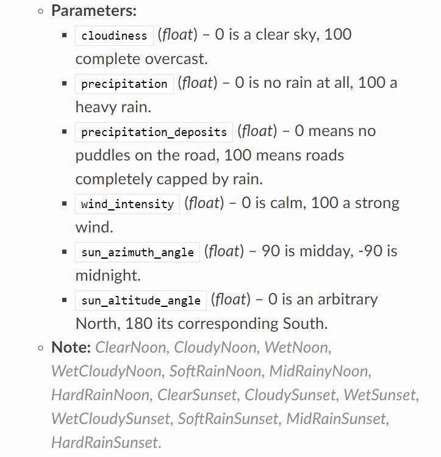

# The World

이 클래스는 시뮬레이션의 주요 지배자 같은 역할을 하며 인스턴스 들은 클라이언트에 의해 회수된다. 클래스 자체로 어떤 모델(Map class의 일부 같은)을 포함하지 않고 시뮬레이션의 보조 장치로 쓰인다. 대부분의 정보와 일반적인 설정은 이 클래스에서 액세스 할 수 있다. 예를 들면,

- Actors and the spectator
- Blueprint library
- Map
- Settings
- Snapshots

사실 이 클래스에서 가장 중요한 방법들 중 하나는 getters이다. 이것은 world가 접근할 수 있는 모든 정보들을 요약한다. world 클래스에 대한 자세한 내용은 [Python API reference](https://carla.readthedocs.io/en/0.9.8/python_api/#carla.World)에서 확인할 수 있다.

## Actors

---

world는 Actor와 관련하여 다양한 방법을 통해 다음을 가능하게 한다.

- Spawn actors (actors 스폰)
- 시뮬레이션 환경에 있는 모든 actor를 얻거나 특정 actor 찾기
- actor를 스폰하는데 사용되는 blueprint library에 액세스
- 시뮬레이션의 시점을 관리하는 spectator actor에 액세스
- actor를 스폰하기 적합한 랜덤한 위치 검색

스폰에 관한 설명은 2번째 스텝에서 이루어지며, blueprint library, 속성 등에 대한 이해를 요구한다. 이 주제에 대해 자세히 알고 싶으면 계속해서 읽거나 [Python API reference](https://carla.readthedocs.io/en/0.9.8/python_api/)에서 확인하면 된다.

## Weather

---

날씨는 그 자체로 클래스가 아니라 world의 설정이다. 하지만 carla.WeatherParameters 클래스를 통해 태양 방향, 구름, 번개, 바람 등과 같은 일련의 시각적 특성을 정의할 수 있다. 날씨 변화는 다음 예와 같이 world를 사용하여 적용할 수 있다.

```python
weather = carla.WeatherParameters(
    cloudiness=80.0,
    precipitation=30.0,
    sun_altitude_angle=70.0)

world.set_weather(weather)

print(world.get_weather())
```

편의를 위해 바로 world에 적용할 수 있는 preset들이 있다. 이것들은 [Python API reference](https://carla.readthedocs.io/en/0.9.8/python_api/#carla.WeatherParameters)에 리스트업 되어있고 다음과 같이 쓰인다.

<p align="center"></img></p>

```python
world.set_weather(carla.WeatherParameters.WetCloudySunset)
```

날씨는 rgb 카메라 센서에만 영향을 주며 actor의 물리학적 환경이나 다른 센서에 영향을 주지 않는다. 또한 강우량이 증가한다고 해서 자동으로 웅덩이가 생기거나 도로의 습도가 바뀌는 것이 아니기 때문에 현실적인 조건들을 추가해야 한다. 그러나 [여기](https://github.com/carla-simulator/carla/blob/master/PythonAPI/examples/dynamic_weather.py)에서 이러한 동적인 날씨 변화의 예를 찾을 수 있다.

## Debugging

---

world 오브젝트는 carla.DebugHelper 오브젝트를 정의하는 공용 속성들을 가진다. 이것은 시뮬레이션 중에 발생하는 이벤트를 추적하기 위해 다양한 모양을 그릴 수 있다. 다음 예제는 actor의 위치와 회전에 빨간 상자를 그리기 위해 속성에 액세스한다.

```python
debug = world.debug
debug.draw_box(carla.BoundingBox(actor_snapshot.get_transform().location,carla.Vector3D(0.5,0.5,2)),actor_snapshot.get_transform().rotation, 0.05, carla.Color(255,0,0,0),0)
```

특정 actor에 상자를 그리려면 [여기](https://carla.readthedocs.io/en/0.9.8/ref_code_recipes/#debug-bounding-box-recipe)를 참조하면 된다.

## World snapshots

---

시뮬레이션에 포함된 모든 actor의 상태를 단일 프레임마다 저장한다. 이 기능을 사용하면 동기 모드를 사용하지 않고도 동일한 시뮬레이션 단계에서 정보를 얻을 수 있다.

```python
# Retrieve a snapshot of the world at current frame.
world_snapshot = world.get_snapshot()
```

carla.WorldSnapshot은 carla.Timestamp와 carla.ActorSnapshot 리스트를 포함한다. Actor snapshot은 actor id로 검색할 수 있으며, 반대로 actor snapshot의 id로 snapshot과 관련된 actor를 찾을 수 있다.

```python
timestamp = world_snapshot.timestamp #Get the time reference 

for actor_snapshot in world_snapshot: #Get the actor and the snapshot information
    actual_actor = world.get_actor(actor_snapshot.id) # 스냅샷 id로 actor 찾기
    actor_snapshot.get_transform()
    actor_snapshot.get_velocity()
    actor_snapshot.get_angular_velocity()
    actor_snapshot.get_acceleration()  

actor_snapshot = world_snapshot.find(actual_actor.id) #Get an actor's snapshot
```